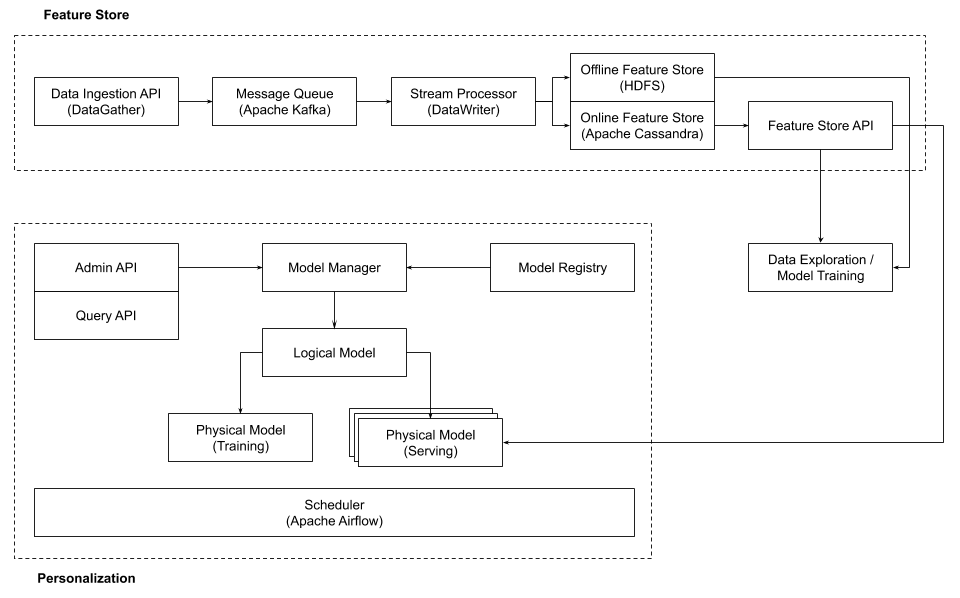
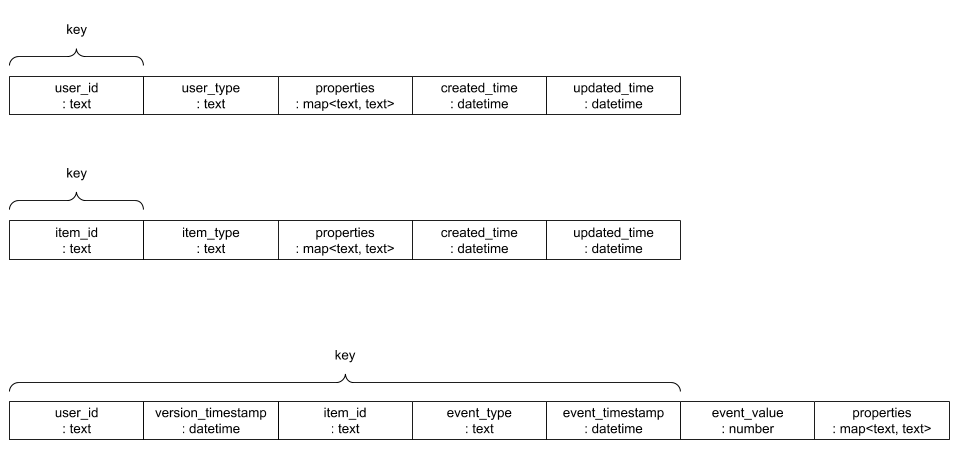

# Overview
Farseer is a fully-featured learning platform, especially focusing to recommendation platform.
It consists of several parts:

* Fact/Feature store
* Fact/Feature serving
* ML/DL model life-cycle manager
* ML/DL model prediction serving

# Architecture
Farseer has two components - feature store and personalization.

# Fact/Feature Store

## Data Model
Data model

# Fact/Feature Serving

## Offline Fact/Feature Serving
## Online Fact/Feature Serving
